# L-Systems Plant
**By Janine Liu / jliu99**

# External Resources

In addition to the class lectures and powerpoints, I consulted a few external resources for this project:
- http://pcgbook.com/wp-content/uploads/chapter05.pdf, for inspiration with the L-system grammar rules.
- https://www.turbosquid.com/3d-models/iconic-heart-3ds-free/389728, for the heart model
- https://www.turbosquid.com/3d-models/pot-garden-ma-free/957561, for the pot model

# Live GitHub demo
https://j9liu.github.io/plant/

# L-System Ruleset

I incorporated probability into both my expansion and drawing rules. To pick an outcome, I would generate a random number, then sum the probability of the rules until it was equal to or greater than the random number. Due to the use of the Math.random() function, the seed is not consistent and changes upon refreshing or changing any features with the GUI.

The initial axiom provided was "SSSF."

**Expansion Rules**

'F' -> 'S-[SSSSLF]+S' with 25% probability, '[+SSSCLF]-CSSSLF' with 75% probability.

'S' -> 'SS+SL' with 10% probability, 'S+SLF' with 10% probability, 'S' with 80% probability.

**Drawing Rules**

'[' -> Push the turtle's current position and orientation onto the stack.

']' -> Pop the previous turtle's position and orientation off the stack.

'+' -> Rotate the user-specified angle counter-clockwise in the y- and z-directions.

'-' -> Rotate the user-specified angle clockwise in the y- and z-directions.

'S' -> Draw a straight branch, composed of one cylinder instance.

'C' -> Draw a curved branch, composed of a couple cylinder instances.

'F' -> Draw a fruit at the current position.

'L' -> Draw a leaf at the current position with a 60% probability (to reduce leaf clutter).

# Aesthetic Features

The background is a simple gradient between a bright blue and pastel yellow, based on the y-coordinate of the screen.

The pot is a free asset (linked above), colored and filled with a cylinder of dark brown for soil.

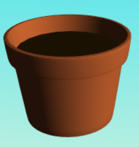

This is a work-in-progress shot of the L-systems, where the branches are a composition of multiple cylinder instances. The cylinder was pulled form the default polygon meshes in Maya. The user may adjust the recursion level, although it is limited due to the clutter that occurs above a depth of 6.

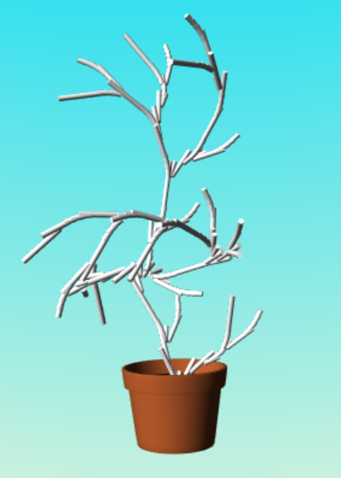

Additionally, the user may modify the angle at which the turtle rotates to make new branches. This formation occurs when the angle is set to 0...

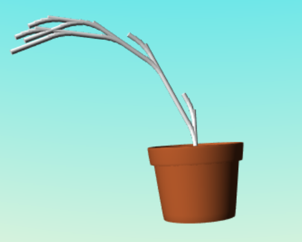

... while something like this will be built when the angle is set to 20.

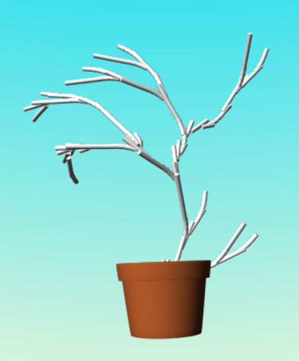

In addition to being colored green, the branches appear more organic with the help of scaling. Each recursion depth scales the branches to be slightly smaller, so the deeper into the recursion, the thinner the branch. Additionally, the curved branches taper towards the end, which is especially apparent at the deepest recursion levels.

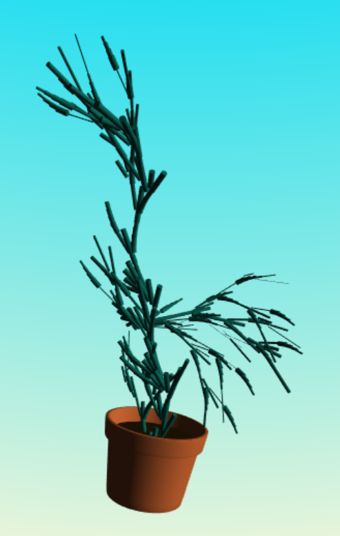

Using Maya, I created a leaf asset which was then interleaved (pun intended) with the branches. These leaves are inversely scaled, such that the deeper they occur in recursion, the larger they scale.

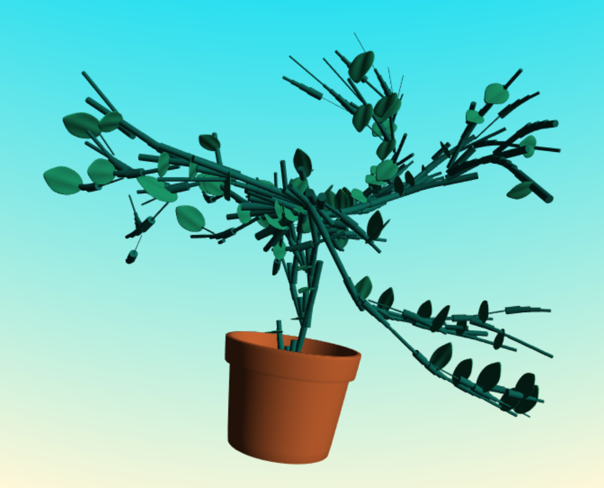

I also added "fruits" to the plant using the free heart asset. These only occur above a certain recursion level, so that the small plants won't be burdened with fruit. These also scale inversely with recursion, and are rotated a random amount around the y-axis for variety.

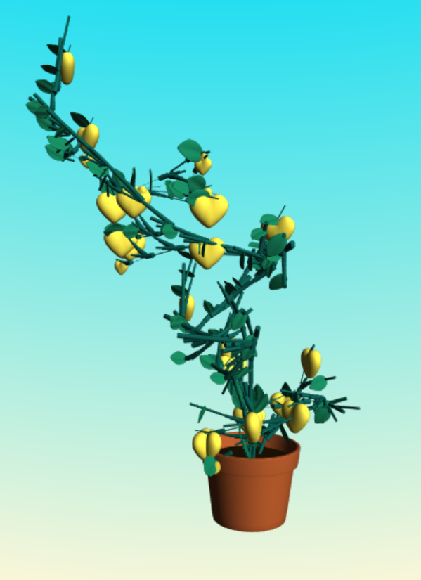

The user may also adjust the color of the fruits to their liking.

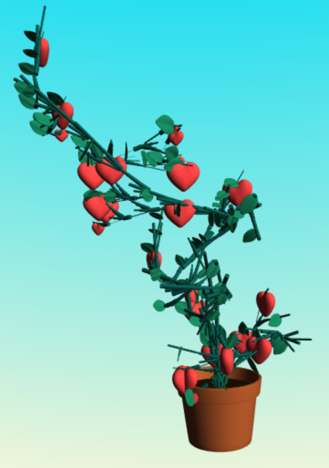

Finally, I added a block of wood that is passed into its own shader for procedural texturing. This method generates FBM noise with a warped domain, takes the fractal component, and passes it into a wood-colored cosine palette, which is then integrated with the original base color. The domain is based on a multiple of the x-position, with a cosine factor based on the sum of the y- and z-positions to add the waves.

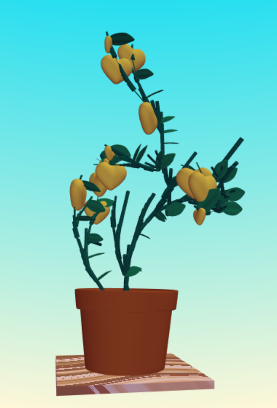

Due to the probability and the lack of consistent seeding, every plant that is generated is different. Here are some examples of what plant structures can arise from playing around with the features and refreshing.

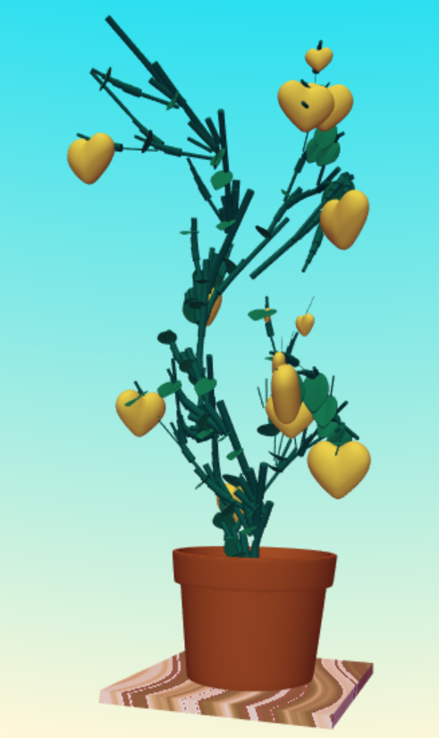

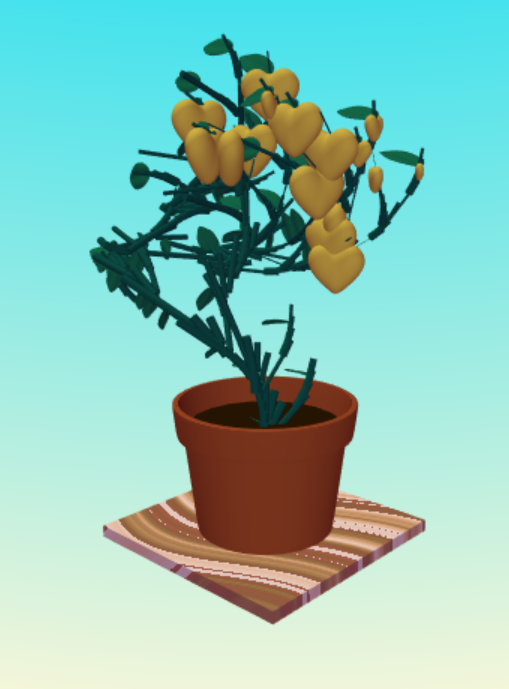

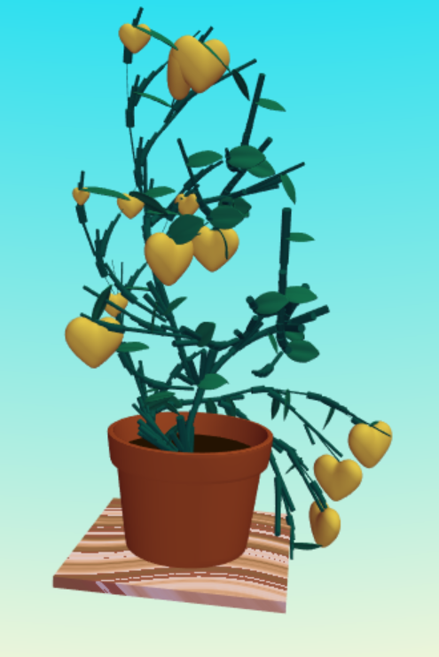

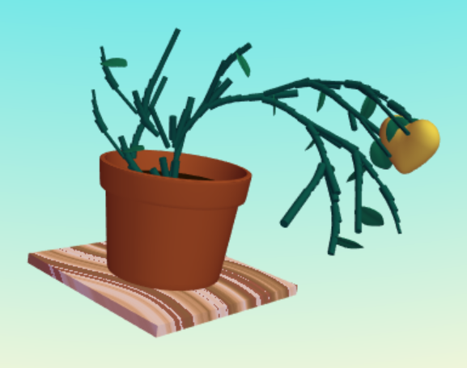

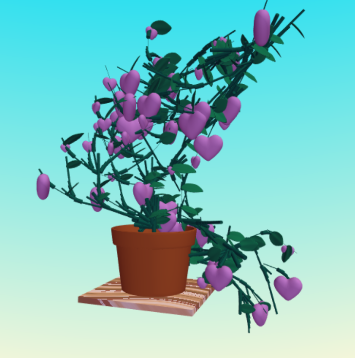